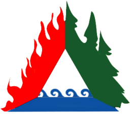

# IntelliFire 
|||
|------------|-------------|
|  |  |
| IntelliFire      | EasyMap      |

## Wildfire Intelligence and Descsion Support System

- The Primary Wildfire Decision Support System for the Government of the Northwest Territories.
- Written in-house by [Franco Nogarin](https://github.com/spydmobile) with Some components contracted to [Heartland Software Solutions](https://www.heartlandsoftware.ca/)

### Project Status
Currently in Active Development, IntelliFire is in live Alpha Testing, with in situ Beta Testing to begin fire season 2023

### Features
- 100% Web based
- GOES Weather Collection
- Canadian Forest Fire Danger System (FWI/FBP)
- Fast Geospatial Display
- Built in Spatial(GIS) Tools
- Wildfire Modelling (W.I.S.E)
- Manage:
  - Wildfires
    - fire growth
    - perimters
  - Hotspots
  - Weather
  - Forecasts
  - Lightning
  - Aircraft
  - Duty Logs

### Technical Features
- Open Source
- Lighweight backend and front end
- Follows OGC Standards 
- Service Oriented Architecture
- Microservices layer
- Stand alone or Container Based
- runs on Windows/Linux/MacOS

## Application Screenshots

</img> </img> </img> </img> </img> </img> </img> </img> </img> </img> </img> </img> </img> </img> </img> </img> </img> </img> </img> </img> </img> </img> </img> </img> </img> 
